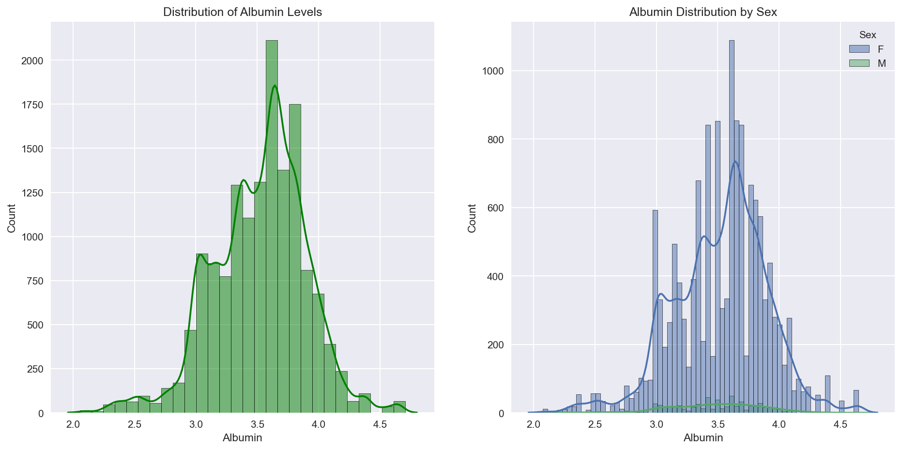
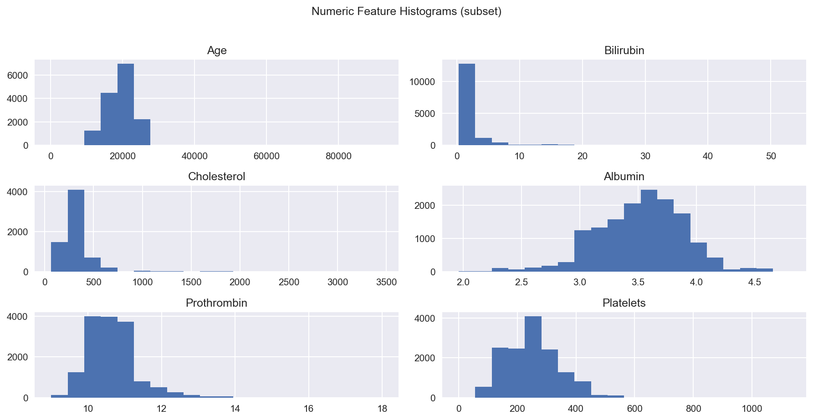
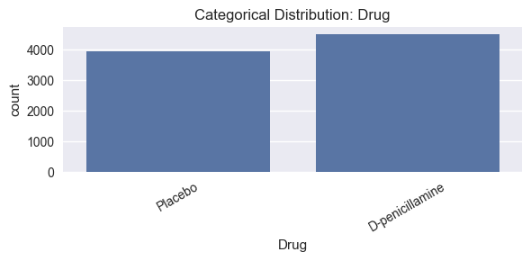
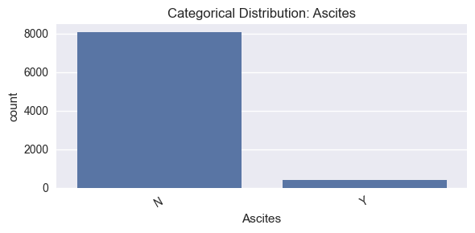
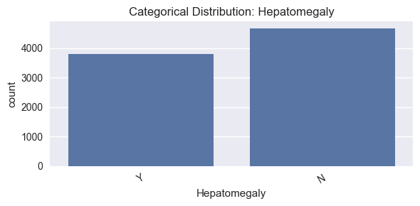
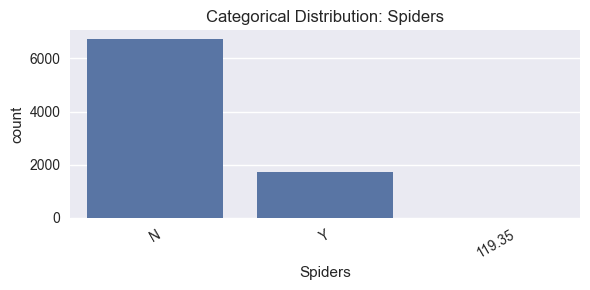
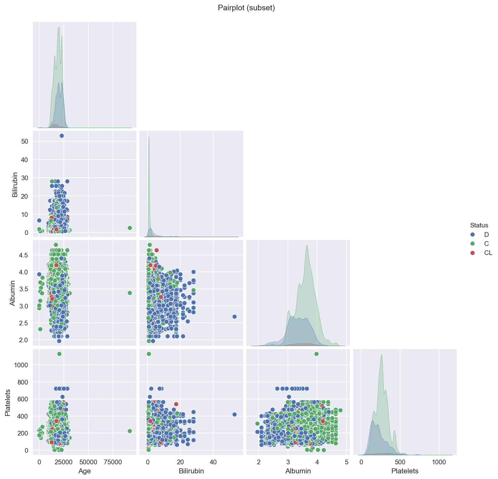

# Reports: Figure Explanations

_Generated on 2025-11-27 21:18:59_

## 01. Distribution Of Bilirubin Levels

Univariate distribution of Bilirubin. Right-skew expected; motivates log1p transform.

## 02. Distribution Of Albumin Levels

Univariate distribution of Albumin. Lower values reflect poorer synthetic function.

## 03. Target Class Distribution (train)

_20251127-205616.png)

Class counts for the target (C, CL, D). Inspect imbalance to guide CV and metrics.

## 04. Age

Figure generated during EDA/modeling. Inspect title and axes to interpret trends, distributions, or performance.

## 05. Correlation Heatmap (train Numeric Features)

_20251127-205618.png)

Correlation matrix among numeric labs. Blocks indicate multicollinearity; informs ratio features and pruning.

## 06. Missing Values (top 20) - Train

_-_train_20251127-205618.png)

Top columns by percent missing. Guides imputation strategy and potential missingness indicators.

## 07. Categorical Distribution Drug

Category frequency for DRUG. Highlights dominant/rare categories and potential imbalance.

## 08. Categorical Distribution Ascites

Category frequency for Ascites. Highlights dominant/rare categories and potential imbalance.

## 09. Categorical Distribution Hepatomegaly

Category frequency for Hepatomegaly. Highlights dominant/rare categories and potential imbalance.

## 10. Categorical Distribution Spiders

Category frequency for Spiders. Highlights dominant/rare categories and potential imbalance.

## 11. Categorical Distribution Edema

Category frequency for Edema. Highlights dominant/rare categories and potential imbalance.

## 12. Figure

Figure generated during EDA/modeling. Inspect title and axes to interpret trends, distributions, or performance.

## 13. Pca 2d Scatter (train Numeric)

_20251127-205633.png)

2D PCA projection of numeric features colored by class to visualize global structure and overlap.

## 14. Confusion Matrix (oof)

_20251127-211146.png)

OOF confusion matrix. Off-diagonals reveal systematic misclassifications between classes.

## 15. Reliability Diagram (oof)

_20251127-211147.png)

Calibration curve comparing predicted confidence to empirical accuracy; assesses probability calibration.
